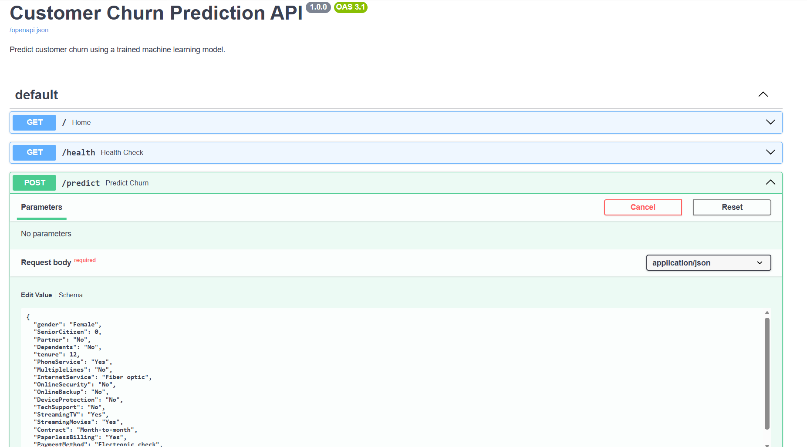
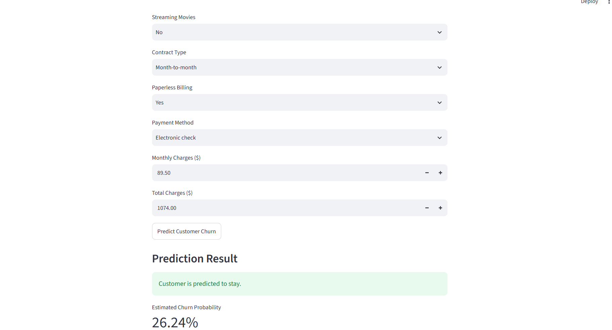

# Customer Churn Prediction – MLOps Project

An end-to-end machine learning application that predicts whether a telecom customer is likely to leave a service.

This project demonstrates machine learning model training, preprocessing pipelines, REST API development, interactive application development, and Docker containerization.

## Project Overview

The application takes customer information such as tenure, contract type, internet service, monthly charges, and payment method to predict customer churn.

The system includes:

- A trained Logistic Regression model
- A Scikit-learn preprocessing and prediction pipeline
- A FastAPI prediction service
- A Streamlit user interface
- A Dockerized API

## Technologies Used

- Python
- Pandas and NumPy
- Scikit-learn
- Joblib
- FastAPI
- Uvicorn
- Streamlit
- Requests
- Docker

## Dataset

Telco Customer Churn Dataset

- Original records: 7,043
- Records after cleaning: 7,032
- Input features: 19
- Target variable: Churn

## Machine Learning Model

The application uses Logistic Regression to predict customer churn.

### Model Evaluation

| Metric | Result |
|---|---:|
| Accuracy | Approximately 80% |
| Churn precision | 65% |
| Churn recall | 57% |
| Churn F1-score | 61% |

The complete preprocessing and machine learning pipeline is saved as `churn_model.joblib`.

## Application Architecture

```text
Customer
   |
   v
Streamlit Web Application
   |
   v
FastAPI REST API
   |
   v
Preprocessing Pipeline
   |
   v
Logistic Regression Model
   |
   v
Churn Prediction + Probability
```

The FastAPI service is packaged inside a Docker container.

## API Endpoints

| Method | Endpoint | Description |
|---|---|---|
| GET | `/` | API information |
| GET | `/health` | Check API and model status |
| POST | `/predict` | Generate customer churn prediction |

## Running the Project Locally

Install the dependencies:

```bash
pip install -r requirements.txt
```

Start the API:

```bash
python -m uvicorn api:app --reload
```

Start the Streamlit application in another terminal:

```bash
python -m streamlit run app.py
```

## Running the API with Docker

Build the Docker image:

```bash
docker build -t customer-churn-api .
```

Run the container:

```bash
docker run --rm -p 8001:8000 customer-churn-api
```

API documentation:

```text
http://localhost:8001/docs
```

Health check:

```text
http://localhost:8001/health
```

The Streamlit application is configured to communicate with the Dockerized API through port 8001.

## Example Prediction

The Dockerized API was tested successfully using customer information.

Example response:

```json
{
  "churn_prediction": "Yes",
  "churn_probability": 0.7233,
  "churn_probability_percentage": 72.33
}
```

## Future Improvements

- Add automated model testing
- Implement CI/CD using GitHub Actions
- Track experiments and model versions using MLflow
- Add model monitoring
- Deploy the application to a cloud platform

## Project Purpose

This project demonstrates an end-to-end machine learning workflow, from data preparation and model training to API development, containerization, and interactive predictions.
## Application Screenshots

### Streamlit Prediction Interface

The interactive Streamlit application allows users to enter customer information and view the predicted churn outcome and estimated churn probability.



### FastAPI Prediction Interface

The FastAPI Swagger documentation allows users to test the customer churn prediction endpoint.

